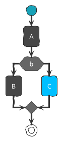

个人是比较喜欢手绘手格的图表的，就收集了一下如何把一些图表的内容整理成手绘的风格。


## plantuml 手绘风 {#plantuml-手绘风}

对于流程图和活动图、状态图，主要都是使用的 plantuml 绘制，最近翻看了一下官方提供的主题，个人比较喜欢的主题有三个，其中 sketchy 是手绘风。





另外 minty 和 reddress-lightred 的风格也非常不错，适合用在正式的图表中。


## matplotlib 手绘风 {#matplotlib-手绘风}

对于使用 Python 进行图表生成的人来说，这个就是一个比较常见的风格了，具体的结果如下，主要是使用 pyplot.xkcd 的主题进行绘图。

```python
import pandas as pd
import numpy as np
import matplotlib.pyplot as plt

with plt.xkcd():
    fig, ax = plt.subplots(figsize=(6.5,4),dpi=100)
    ax = df.plot.bar(color=["#BC3C28","#0972B5"],ec="black",rot=15,ax=ax)
    ax.set_ylim((0, 100))
    ax.legend(frameon=False)
    ax.set_title("EXAMPLE01 OF MATPLOTLIB.XKCD()",pad=20)
    ax.text(.8,-.22,'Visualization by DataCharm',transform = ax.transAxes,
            ha='center', va='center',fontsize = 10,color='black')
```


## chart.xkcd {#chart-dot-xkcd}

chart.xkcd 是手绘风的 javascript 库，也是许多手绘风图表的基础库，可以通过引入对应的 js 包来直接绘制对应的图表。

<https://timqian.com/chart.xkcd/>

-   柱状图

<!--listend-->

```javascript
<svg class="bar-chart"></svg>
<script src="https://cdn.jsdelivr.net/npm/chart.xkcd@1.1/dist/chart.xkcd.min.js"></script>
<script>
  const svg = document.querySelector('.bar-chart')

const barChart = new chartXkcd.Bar(svg, {
  title: 'github stars VS patron number', // optional
  // xLabel: '', // optional
  // yLabel: '', // optional
  data: {
    labels: ['github stars', 'patrons'],
    datasets: [{
      data: [100, 2],
    }],
  },
  options: { // optional
    yTickCount: 2,
  },
});

</script>
```

-   堆叠柱状图

<!--listend-->

```javascript
<svg class="stacked-bar-chart"></svg>
<script src="https://cdn.jsdelivr.net/npm/chart.xkcd@1.1.12/dist/chart.xkcd.min.js"></script>
<script>
const svgStackedBar = document.querySelector('.stacked-bar-chart');
new chartXkcd.StackedBar(svgStackedBar, {
  title: 'Issues and PR Submissions',
  xLabel: 'Month',
  yLabel: 'Count',
  data: {
    labels: ['Jan', 'Feb', 'Mar', 'April', 'May'],
    datasets: [{
      label: 'Issues',
      data: [12, 19, 11, 29, 17],
    }, {
      label: 'PRs',
      data: [3, 5, 2, 4, 1],
    }, {
      label: 'Merges',
      data: [2, 3, 0, 1, 1],
    }],
  },
});

</script>
```

-   饼图
    ```javascript
    <svg class="pie-chart"></svg>
    <script src="https://cdn.jsdelivr.net/npm/chart.xkcd@1.1/dist/chart.xkcd.min.js"></script>
    <script>
      const svg = document.querySelector('.pie-chart');
      const pieChart = new chartXkcd.Pie(svg, {
        title: 'What Tim made of', // optional
        data: {
          labels: ['a', 'b', 'e', 'f', 'g'],
          datasets: [{
            data: [500, 200, 80, 90, 100],
          }],
        },
        options: { // optional
          innerRadius: 0.5,
          legendPosition: chartXkcd.config.positionType.upRight,
        },
      });

    </script>
    ```


## cutecharts 手绘风 {#cutecharts-手绘风}

-   柱状图

<!--listend-->

```python
from cutecharts.charts import Bar
from cutecharts.components import Page
from cutecharts.faker import Faker


def bar_base() -> Bar:
    chart = Bar("Bar-基本示例")
    chart.set_options(labels=Faker.choose(), x_label="I'm xlabel", y_label="I'm ylabel")
    chart.add_series("series-A", Faker.values())
    return chart

bar_base().render()
```

-   饼图
    ```python
    from cutecharts.charts import Pie
    from cutecharts.components import Page
    from cutecharts.faker import Faker


    def pie_base() -> Pie:
        chart = Pie("Pie-基本示例")
        chart.set_options(labels=Faker.choose())
        chart.add_series(Faker.values())
        return chart


    pie_base().render()
    ```
